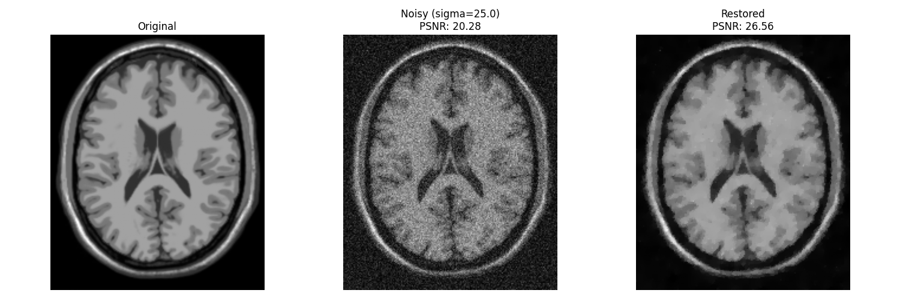

# Rician Noise Denoising (Chen & Zeng, 2015)

基于全变分（Total Variation）和严格凸变分模型的 Rician 噪声去噪算法复现项目。

本项目是非官方的 Python 实现版本，原论文为：
> **A Convex Variational Model for Restoring Blurred Images with Large Rician Noise** > *Liyuan Chen, Tieyong Zeng* (Journal of Mathematical Imaging and Vision, 2015)

## 📖 项目简介

在医学影像（如磁共振成像 MRI）中，图像极易受到 Rician 噪声的污染。传统的最大后验估计（MAP）模型往往是非凸的，导致优化算法容易陷入局部最优。

Chen 和 Zeng 在论文中通过引入额外的数据保真项，提出了一种**严格凸的变分模型**。本项目主要复现了论文中的核心去噪算法（Algorithm 1），并对原论文中的部分数值计算稳定性问题进行了工程上的优化。

### ✨ 核心亮点：
1. **模块化架构**：将数学算子（Operators）、模型目标函数（Models）和求解器（Solvers）彻底解耦，代码结构清晰，易于向去模糊（Deblurring）扩展。
2. **数值稳定性优化**：在求解子问题时，弃用了原论文中在暗部区域易发生梯度爆炸的牛顿法，改用**显式线性化主对偶算法 (Linearized Primal-Dual)**，彻底解决了数值溢出问题，实现了极其稳定的全局收敛。
3. **贝塞尔函数安全计算**：使用 `scipy.special.ive`（带指数缩放的修正贝塞尔函数）替代常规计算，防止在高信噪比区域发生内存溢出（NaN）。
4. **偏差校正 (Bias Correction)**：实现了针对 Rician 噪声特性的均值偏差补偿，有效提升了低信噪比下图像的对比度。

## 📁 项目结构

```text
RicianDenoising_Chen2015/
├── src/
│   ├── models.py       # 目标函数及其导数的定义
│   ├── operators.py    # 差分算子 (离散梯度与散度)
│   ├── solvers.py      # 优化的显式主对偶求解器 (PDHG)
│   └── utils.py        # 辅助工具 (噪声生成、偏差校正)
├── tests/              # 单元测试模块 (可选)
├── main.py             # 主程序入口，包含完整的数据加载、去噪与评估流程
├── requirements.txt    # 环境依赖列表
└── README.md           # 项目文档
```

## ⚙️ 环境依赖

请确保您的环境中安装了 Python 3.7+。建议使用虚拟环境运行，执行以下命令安装所需核心依赖：

```bash
pip install numpy scipy scikit-image matplotlib
```

## 🚀 快速开始

克隆本项目后，直接运行主入口文件即可查看去噪效果：

```bash
python main.py
```

代码会自动加载默认的测试图像（Brain），添加 $\sigma=25$ 的 Rician 噪声，运行去噪算法与偏差校正，最终在终端输出 PSNR 与 SSIM 指标，并弹出对比效果图。

## 📊 实验结果

实验采用从Brainweb上获取的模拟MRI图像，在 $\sigma=25$ 的 Rician 噪声(固定seed=45)下，brain 图像的恢复效果如下：

* **Noisy Image**: PSNR $\approx 20.28$ dB, SSIM $\approx 0.6641$
* **Restored Image**: PSNR $\approx 26.56$ dB, SSIM $\approx 0.8958$




## 📜 参考文献

* Chen, L., & Zeng, T. (2015). A Convex Variational Model for Restoring Blurred Images with Large Rician Noise. *Journal of Mathematical Imaging and Vision*, 53(1), 92-111. [DOI: 10.1007/s10851-014-0551-y]